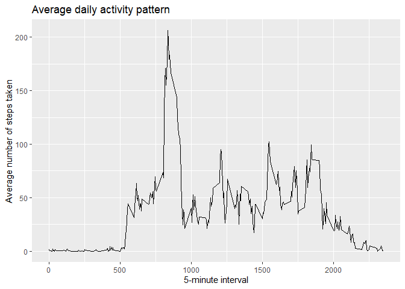

## Loading and preprocessing the data

```r
library(tidyverse)
library(lubridate)
library(ggplot2)
library(dplyr)
```


```r
unzip("activity.zip")
activity <- read.csv("activity.csv", stringsAsFactors = FALSE)
file.remove("activity.csv")
```

```
## [1] TRUE
```

```r
activity$date <- ymd(activity$date)
```

## What is mean total number of steps taken per day?

```r
g <- activity %>% filter(!is.na(activity$steps)) %>% group_by(date) %>% summarise(total_steps=sum(steps))
g1 <- ggplot(g, aes(total_steps))
g1 + geom_histogram() + ggtitle("Histogram of the total number of steps taken per day") + xlab("Total Steps") + ylab("Count")
```

<!-- -->

**Mean of the total number of steps taken per day**

```r
mean(g$total_steps)
```

```
## [1] 10766.19
```

**Median of the total number of steps taken per day**

```r
median(g$total_steps)
```

```
## [1] 10765
```

## What is the average daily activity pattern?

```r
g2 <- activity %>% filter(!is.na(activity$steps)) %>% group_by(interval) %>% summarise(steps_avg=mean(steps))
g3 <- ggplot(g2,aes(interval,steps_avg))
g3 + geom_line() + xlab("5-minute interval") + ylab("Average number of steps taken") + ggtitle("Average daily activity pattern")
```

<!-- -->

**5 minute interval which contains the maximum number of steps**

```r
g2$interval[which.max(g2$steps_avg)]
```

```
## [1] 835
```

## Imputing missing values
**Total number of missing values in the dataset**

```r
sum(is.na(activity))
```

```
## [1] 2304
```
**New Dataset with NAs replaced with mean steps for 5-minute intervals**

```r
# New Dataset
activity2 <- activity
# Index of NA values
index <- is.na(activity2$steps)
# Replacing NA values with average steps of corresponding intervals
activity2$steps[index] <- ifelse(activity2$interval[index] == g2$interval, g2$steps_avg)
```


```r
g4 <- activity2 %>% group_by(date) %>% summarise(total_steps=sum(steps))
g5 <- ggplot(g4, aes(total_steps))
g5 + geom_histogram() + ggtitle("Histogram of the total number of steps taken per day, with imputed NAs") + xlab("Total Steps") + ylab("Count")
```

<!-- -->

**Mean of the total number of steps taken per day**

```r
mean(g4$total_steps)
```

```
## [1] 10766.19
```

**Median of the total number of steps taken per day**

```r
median(g4$total_steps)
```

```
## [1] 10766.19
```
**No change in mean and the median changes a little.**

## Are there differences in activity patterns between weekdays and weekends?


```r
activity2$day <- factor(ifelse(weekdays(activity2$date) %in% c("Saturday","Sunday"), "weekend", "weekday"))
```


```r
g6 <- activity2 %>% group_by(day,interval) %>% summarise(steps_avg=mean(steps))
g7 <- ggplot(g6,aes(interval,steps_avg))
g7 + geom_line() + facet_wrap(.~g6$day, ncol=1) + xlab("5-minute interval") + ylab("Average number of steps taken") + ggtitle("Average daily activity pattern")
```

<!-- -->
